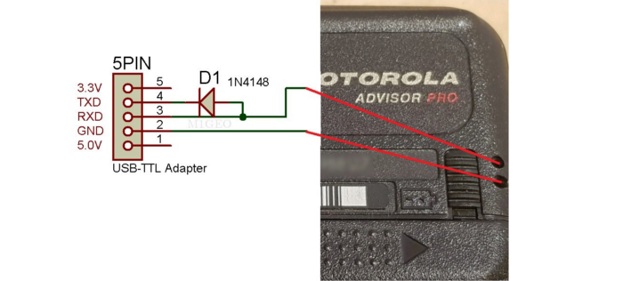

# MOTOROLA ADVISOR II PROGRAMMING DOSBOX

DOSBox container setup for Motorola Advisor II Programming. This allows programming on modern systems (including Linux systems, which are the only system that this has been tested on).

## PREREQUISITES

You're going to need a pager programming dock, or, if you're like me, a homemade rig to do the same:

To create one, you're going to need:

* [USB to Serial Adapter](https://amzn.to/3JXrHU8) - This ran me about $6, and comes with some wires, etc.
* [Diodes](https://amzn.to/3vy7uyX) - Should be under $4 for five of them (although you only need one).
* Splices or solder, and some kind of rigid wire (paperclips will do) to make the contact prongs.

This should look like this when you're done:

